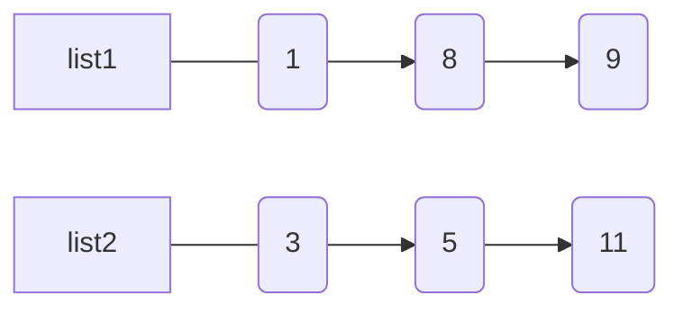
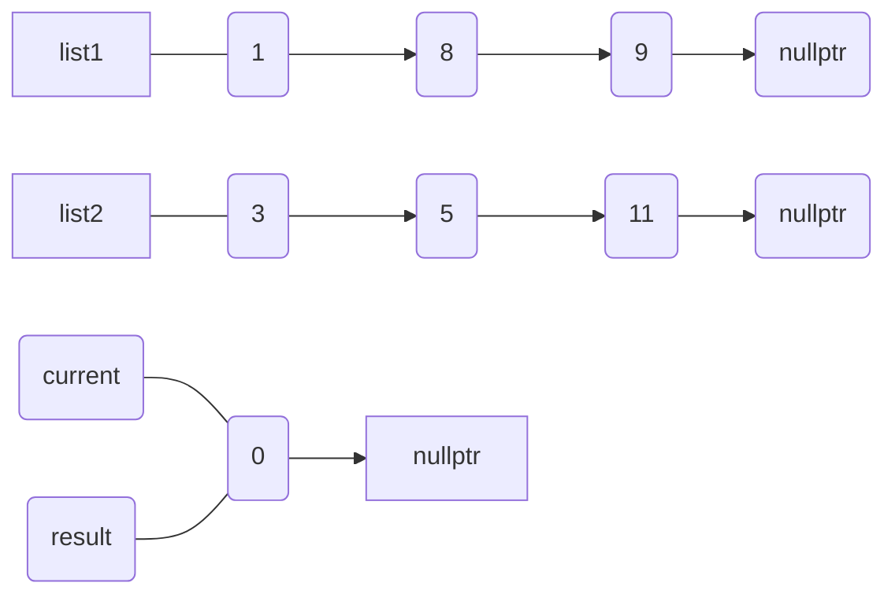
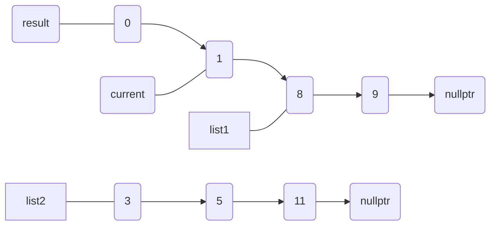
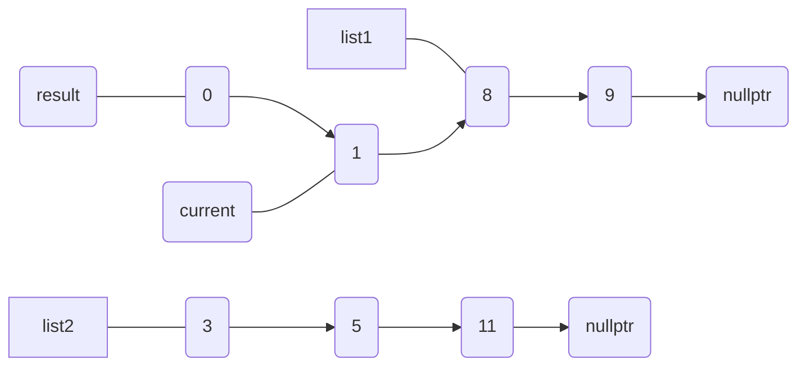
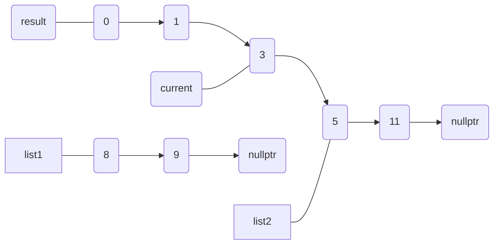
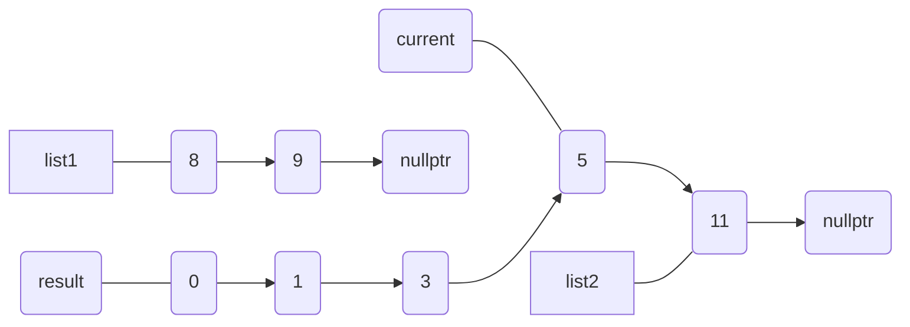
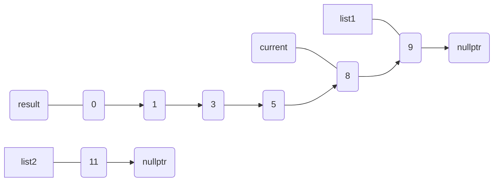
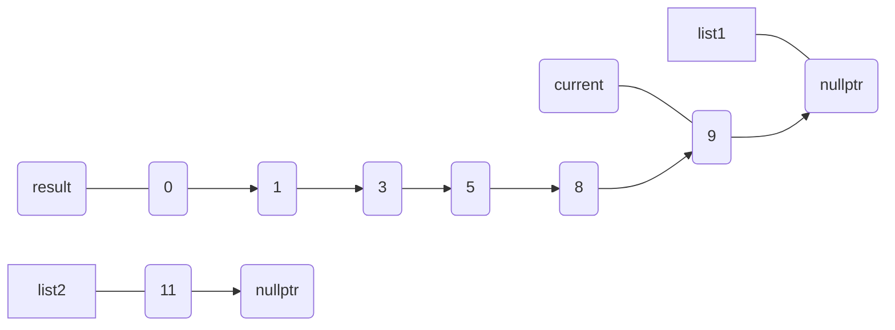
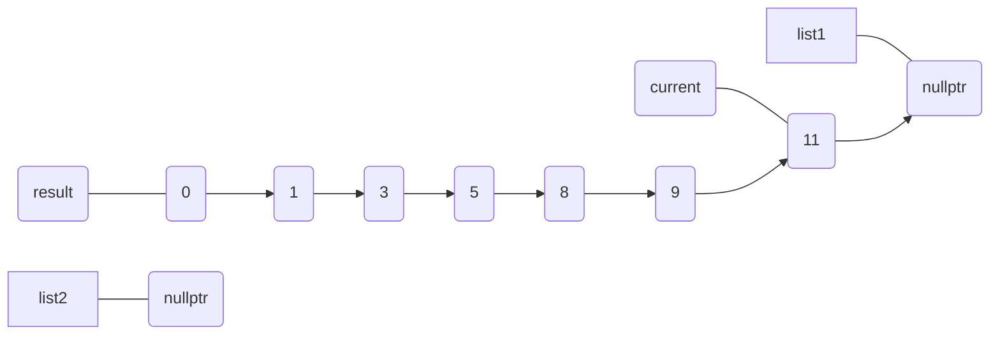

## Merge Two Sorted List

２つのsortされた連結リストlist1, list2をマージして一つのsortされた連結リストをつくる



まずlist1,list2のNULLチェックを行う。

```C++
// NULLチェック
if(!list1 && !list2) {
    return nullptr;
}
if(!list1){
    return list2;
}
if(!list2){
    return list1;
}
```

続いて作業用の新しい連結リストcurrentを動的に生成して、最後に結果を出力するために先頭のポインタを別の変数resultに保持させておく。

```C++
// 作業用
auto current = new ListNode();
// 最後に結果を出力する用
auto result = current;
```

続いてリストをマージするためにlist1 -> val, list2 -> valを比較して小さい方のノードをcurruent -> next が指すようにする。
また採用された方のリストはnextを指すように更新し、最後にcurrentもnextを指すように更新する。

```C++
if(list1->val <= list2->val) {
    current->next = list1;
    list1 = list1->next;
} else {
    current->next = list2;
    list2 = list2->next;
}
current = current->next;
```

これをwhileループでlist1,list2の両方がnullptrでない間(どちらかがnullptrになったら打ち切る)繰り返す。以下に繰り返しの様子を載せる。

初期状態:


ステップ1:


ステップ2:


ステップ3:


ステップ4:


ステップ5:


ステップ6:


ステップ7:


ステップ8:


最後にnullptrでない方のリストの要素をcurrent -> next が指すようにする。
ここまで計算してきたresultの先頭には $0$ が入っているのでこれを捨てるために

```C++
return result->next;
```

とノードを一個スキップしてからreturnする。
