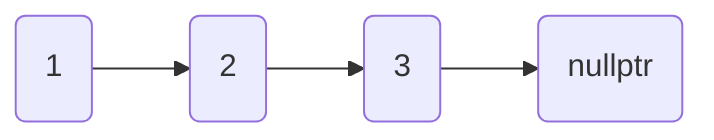
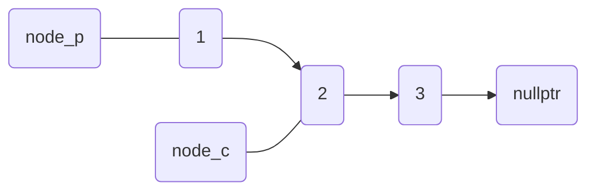
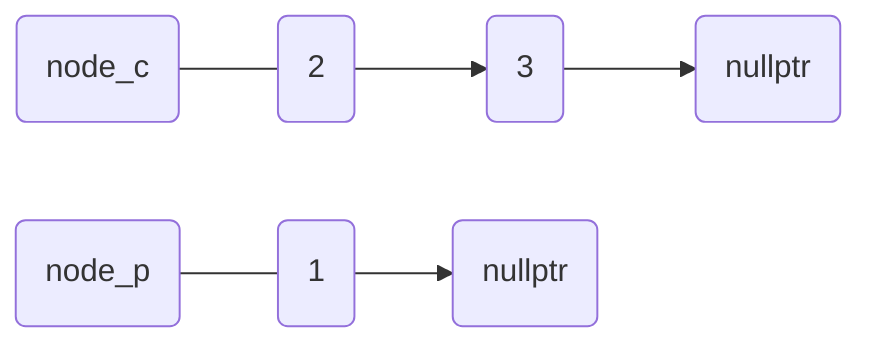
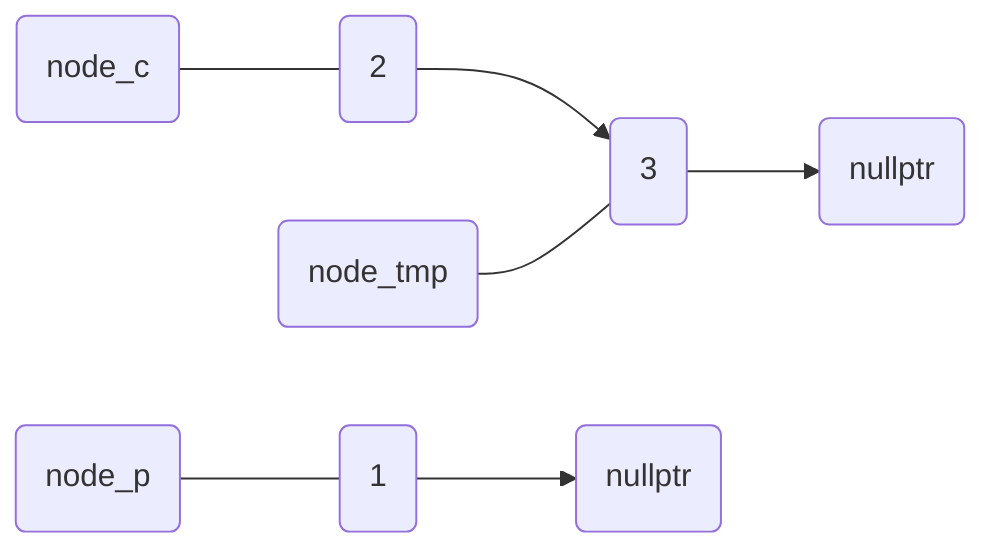
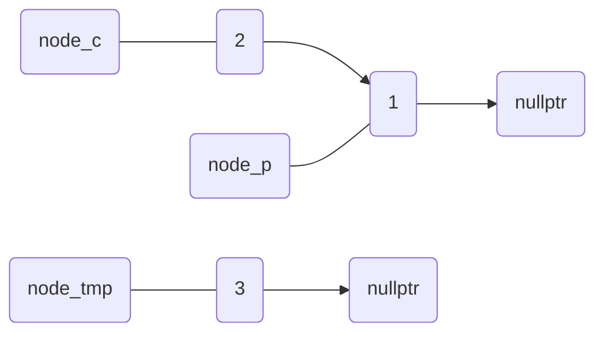
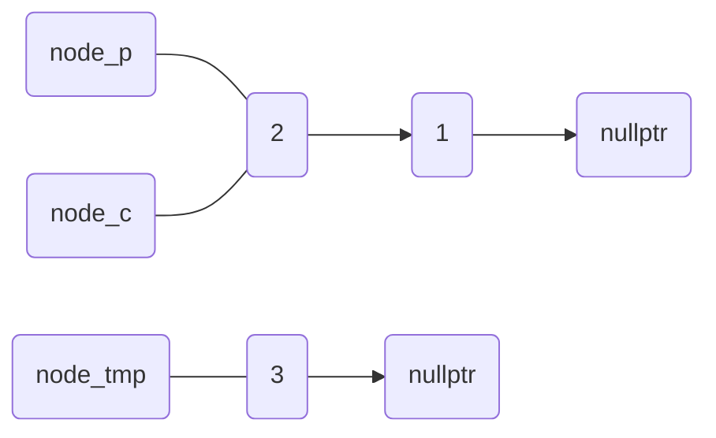
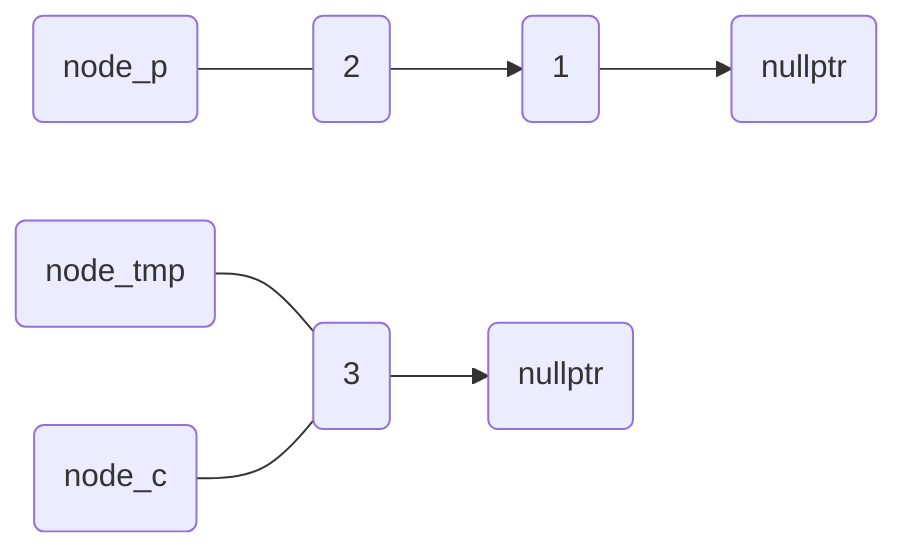
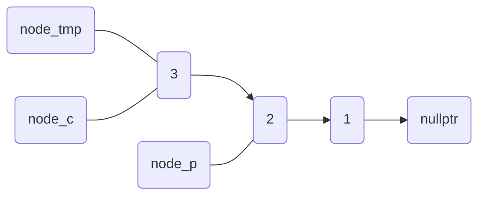

# Linked List 解法メモ

## Reverse Linked List

元の状態



### 初期化

```C++
auto node_p = heda;
auto node_c = head->next; 
node_p->next = nullptr;
```

先頭であるノード $1$ へのポインタをnode\_pに入れ、二番目のノード$2$へのポインタをnode\_c に入れる。このときnode\_pのnextはnullptrを入れる。


このときnode\_p, node\_cは以下のように変化を受ける。

```C++
auto node_p = heda;
auto node_c = head->next; 
```

```C++
node_p->next = nullptr;
```


### ポインタの付替え

```C++
auto node_tmp = node_c->next;
node_c->next = node_p;
node_p = node_c;
node_c = node_tmp;
```

まずnode\_cのnext(ノード $2$ の次のノード)をnode\_tmpに一時的に持たせる。

続いて、ノード $2$ へのポインタを格納しているnode\_cのnextがノードに $1$ へのポインタを格納しているnode\_pへのポインタを格納する

最後にnode\_pがnode\_cを指すように、node\_cがnode\_tmpを指すように更新する。これをnode\_c -> nextがnullptrでない間繰り返す(while文で繰り返す)。

このときのノードの変化とC++のコードの対応は以下のようになる。

```C++
auto node_tmp = node_c->next;
```


```C++
node_c->next = node_p;
```


```C++
node_p = node_c
```


```C++
node_c = node_tmp
```


今のnode\_cのではnode\_c -> next = nullptrであるのでwhileループを抜けて

```C++
node_c->next = node_p;
```

とnode\_cの次のノードを書き換えて,最後にnode\_cへのポインタをretunして終了する。
